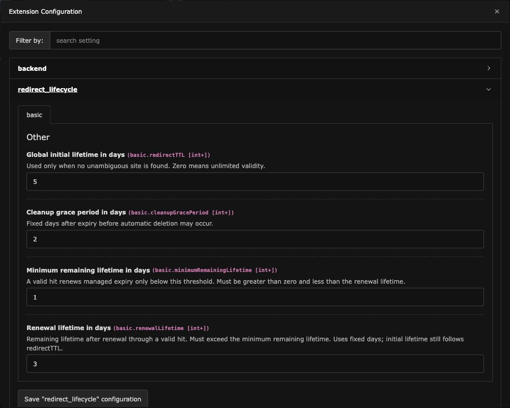
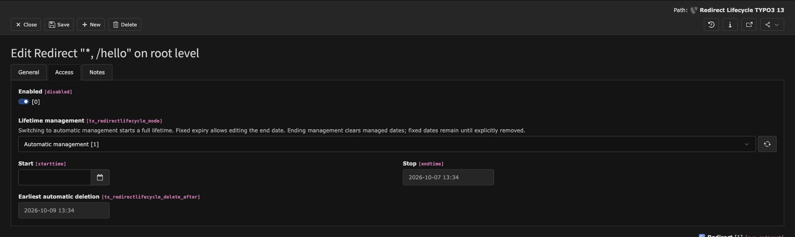
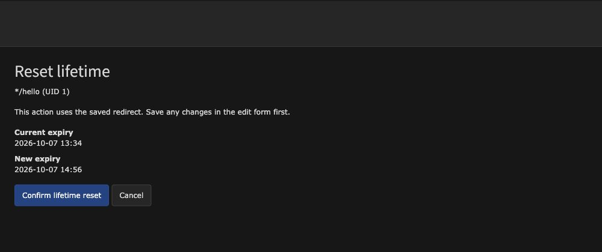

# Redirect Lifecycle

Keep used redirects alive and remove expired ones after a grace period.
Redirect Lifecycle adds automatic lifetime management to TYPO3's native redirects,
with a fixed-expiry option and a backend action to start a fresh lifetime.

Supports TYPO3 **12.4, 13.4, and 14**. Requires PHP **8.1+**, EXT:redirects,
and EXT:scheduler. This extension is currently a development alpha.

## Installation

Until a release is available, install the development branch from its Git repository:

```sh
composer config repositories.redirect-lifecycle vcs https://github.com/thegass/redirect-lifecycle.git
composer require plan2net/redirect-lifecycle:dev-main
vendor/bin/typo3 extension:setup
vendor/bin/typo3 cache:flush
```

Existing redirects keep their current behavior. Installation does not enroll them
in automatic management or activate a cleanup task.

## Configure the lifetime

Set the initial lifetime through TYPO3's site configuration (`config/sites/<site>/config.yaml`):

```yaml
redirects:
  redirectTTL: 180
```

The site's `redirectTTL` determines the lifetime of new managed redirects and
explicit lifetime resets. **Zero means unlimited validity.** If a redirect cannot
be assigned to one site, the extension's global `redirectTTL` is used instead.

In **Admin Tools → Settings → Extension Configuration → redirect_lifecycle**,
configure the installation-wide settings:



The screenshot shows local example values; the defaults are listed below.

| Setting | Default | Purpose |
| --- | --- | --- |
| `redirectTTL` | `0` | Initial lifetime in days when no unambiguous site is found. |
| `minimumRemainingLifetime` | `90` | Renew on a valid hit only below this many remaining days. |
| `renewalLifetime` | `180` | Remaining lifetime in days after hit renewal; must exceed the minimum. |
| `cleanupGracePeriod` | `90` | Days after expiry before scheduled deletion is allowed. |

Initial lifetimes follow Core calendar days. Hit renewal and cleanup grace use
fixed 24-hour days. Changing settings leaves existing dates unchanged until a
lifetime action uses the new values.

## Manage a redirect in the backend

1. Open **Site Management → Redirects** and create or edit a redirect.
2. Open the **Access** tab.
3. Select **Lifetime management**, then save the record.



| Mode | Behavior |
| --- | --- |
| **Automatic management** | Starts a lifetime using the current TTL. Expiry and earliest deletion are read-only; valid hits can extend them. |
| **Fixed expiry time** | Lets you edit the native Stop date. Automatic renewal and lifecycle cleanup stop. |
| **No automatic management** | Ends management and clears managed dates. An existing fixed expiry remains until explicitly removed. |

New normal redirects without a fixed expiry use automatic management, including
redirects created after a page URL changes. On TYPO3 14, QR codes and short URLs
are excluded.

The Core **Protected** switch pauses management and clears managed dates.
Removing protection starts a fresh lifetime for managed redirects. Manually
disabling a redirect prevents hit renewal and cleanup; re-enabling a managed
redirect restarts its lifetime. Editors need the normal TYPO3 field permission
for **Lifetime management**.

### Reset a lifetime

To give a managed redirect a fresh initial lifetime:

1. Save any changes in the edit form.
2. Click **Reset lifetime** beside the lifetime selector.
3. Review the current and proposed expiry, then confirm.



A reset uses the current site TTL or global fallback and replaces both dates.
It can shorten a lifetime; the preview warns when that happens. Protected
redirects and redirects with TTL zero receive no managed dates.

### Renewal through visitors

No editor action is needed for hit renewal. With the defaults, a valid request
with **less than 90 days** remaining renews the redirect to **180 days** from
that request. Further hits at or above the threshold leave the dates unchanged.
Hit counting may be disabled; renewal still works.

A hit never shortens expiry or the stored deletion time. Expired redirects no
longer execute and cannot renew themselves through visitors.

## Adopt existing redirects

Preview existing unmanaged redirects before enrolling them:

```sh
vendor/bin/typo3 redirect-lifecycle:adopt
vendor/bin/typo3 redirect-lifecycle:adopt 100 101 --execute
```

Only active, unprotected normal redirects without an expiry are eligible.
Omitting UIDs with `--execute` adopts all eligible redirects. Already managed
redirects keep their dates.

For an explicit lifetime reset from the command line:

```sh
vendor/bin/typo3 redirect-lifecycle:renew 100
vendor/bin/typo3 redirect-lifecycle:renew 100 --execute
```

Both commands preview by default and write only with `--execute`.

## Schedule cleanup

First inspect the candidates:

```sh
vendor/bin/typo3 redirect-lifecycle:cleanup --dry-run
```

To delete due redirects, run:

```sh
vendor/bin/typo3 redirect-lifecycle:cleanup
```

Cleanup soft-deletes enabled, unprotected managed redirects only after expiry
and their stored grace period. It uses TYPO3 DataHandler and retains record
history. Native restoration starts a new managed lifetime.

For a daily run, add a Scheduler task with an interval of **86400 seconds**:

- **TYPO3 12/13:** choose **Execute console commands**, then `redirect-lifecycle:cleanup`.
- **TYPO3 14:** choose the `redirect-lifecycle:cleanup` task directly.

No task is enabled automatically. Review overlapping cleanup jobs: Core's
`redirects:cleanup` does not follow this extension's grace periods and exclusions.
Before production use, verify behavior with your database, cache, and locking setup.

## Use with Sluggi

[wazum/sluggi](https://github.com/wazum/sluggi) is recommended and optional.
Title synchronization, manual slug changes, and descendant updates create
managed redirects through TYPO3's native events. Sluggi's decision to suppress
redirect creation remains effective. Its URL lock is separate from a redirect's
**Protected** switch.

Integration tests cover Sluggi 14.x on all three development setups.
Known upstream Sluggi deprecations on TYPO3 14 are handled by a narrow test
baseline; see [Sluggi integration](Documentation/development.md#sluggi-integration).

## Development

See the [local development guide](Documentation/development.md) for DDEV setup
and the functional tests, which use disposable SQLite databases.
